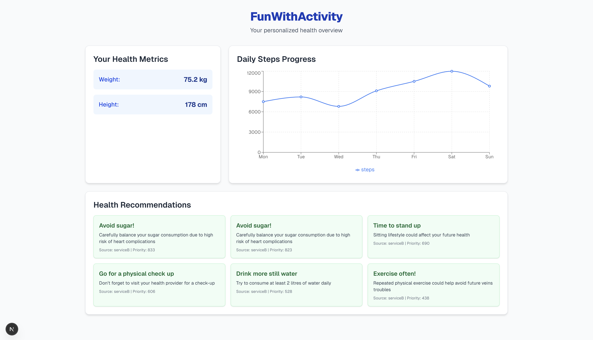

# FunWithActivity

FunWithActivity is a serverless AWS-based health and fitness tracking platform. It ingests user activity data, stores health metrics, and provides personalized recommendations via a Next.js dashboard.



## Features

- **Serverless architecture** using AWS Lambda, DynamoDB, Kinesis, and Step Functions
- **API Gateway** endpoints for ingesting activity logs and fetching user data
- **Multiple recommendation engines** (Service A & B) with aggregation logic
- **Next.js website** for a modern, interactive dashboard
- **Infrastructure as code** with [serverless.yml](serverless.yml)

## Project Structure

- `src/functions/` – Lambda functions for ingestion, recommendations, and API
- `website/` – Next.js frontend app
- `mocks/` – Example events for local testing
- `scripts/` – HTTP request samples for API testing

## Usage

### Deployment

Deploy the backend using the Serverless Framework:

```sh
serverless deploy
```

After deployment, the API Gateway endpoint will be shown in the output.

### API Endpoints

- `POST /activity` – Ingest user activity (logs to Kinesis)
- `GET /user-stats` – Get user health metrics
- `GET /recommendations` – Get personalized recommendations

See [scripts/](scripts/) for example requests.

### Local Development

- **Backend:**  
  Use `serverless dev` for local Lambda emulation.
- **Frontend:**  
  ```sh
  cd website
  npm install
  npm run dev
  ```
  Then open [http://localhost:3000](http://localhost:3000).

## Learn More

- [serverless.yml](serverless.yml) – Full infrastructure definition
- [website/README.md](website/README.md) – Frontend details

---